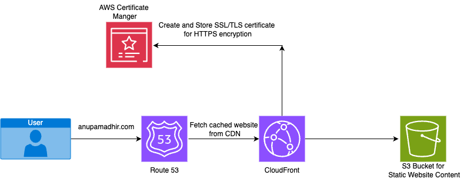
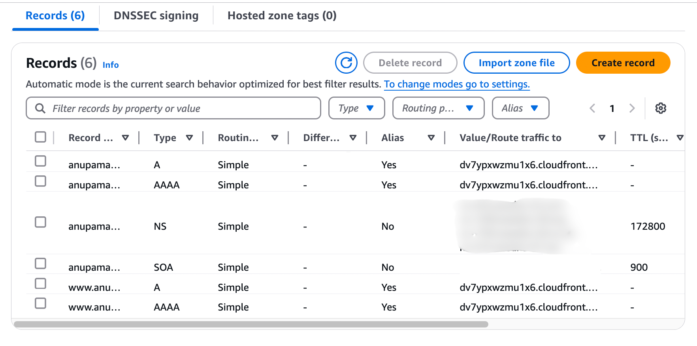
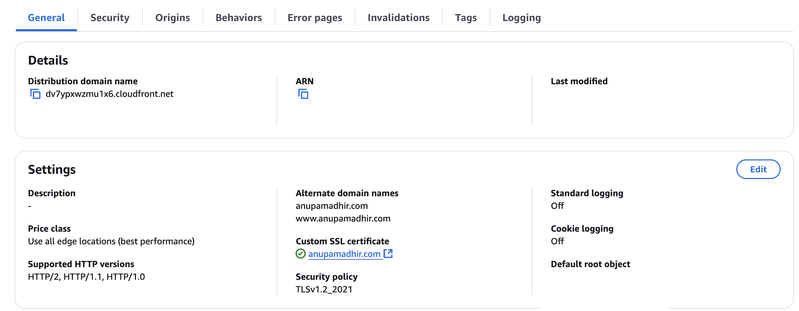
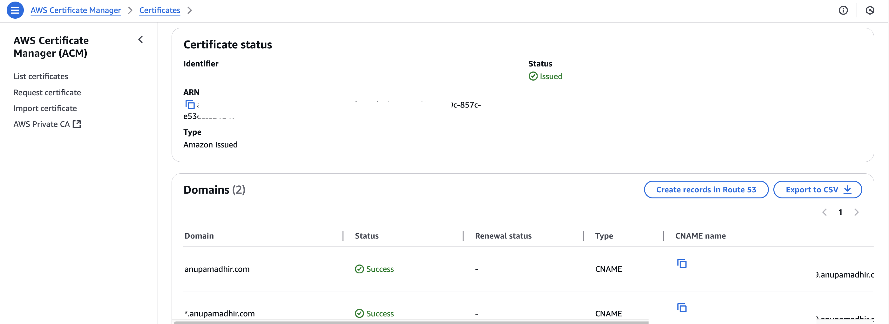
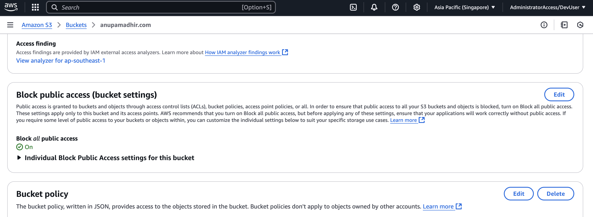

# Cloud Resume Challenge

## Week 1 Challenge
Create a cloud-hosted resume as the frontend of the application. You can find my [resume](https://anupamadhir.com) here.
I used HTML and CSS to build a responsive web page and hosted it in an S3 bucket as a static website behind a CloudFront(CDN) distribution.
I bought the domain name from Namecheap and used Amazon Certificate Manager to generate an SSL certificate to enable https on my website.
I setup Amazon Route 53 as the DNS provider and setup the alias records to point to the CloudFront Distribution.

### Route 53 Settings:

### CloudFront Settings:

### Certificate Manager
Request a public Certificate in the N. Virginia Region for anupamadhir.com
and add the subdomains.

Issued Certificate

### S3 Bucket
Created 2 Buckets. The files are uploaded to anupamadhir.com and www.anupamadhir.com redirects request to anupamadhir.com bucket.
 

 

#### Under Bucket Permissions turned on Block public access

 

#### Enabled static website hosting for bucket

